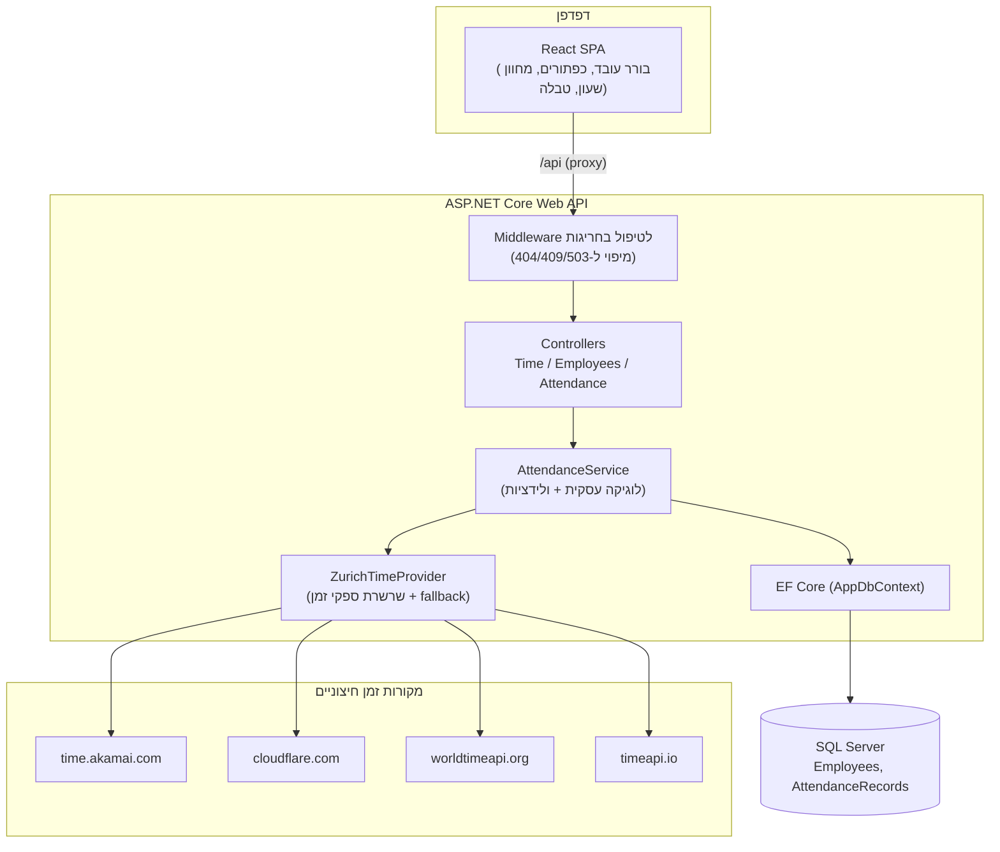
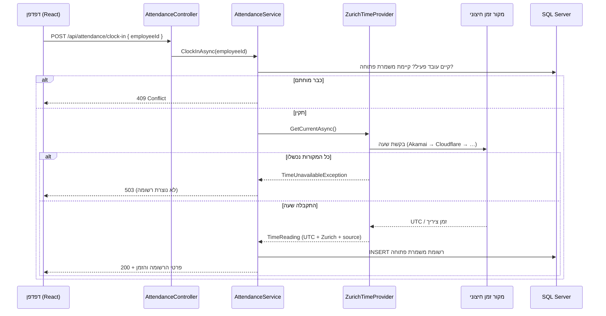

# מסמך ארכיטקטורה — שעון נוכחות (Europe/Zurich)

מסמך זה מתאר את הארכיטקטורה, זרימות הנתונים, מודל הנתונים וההחלטות ההנדסיות של מערכת החתמת
הנוכחות. לתיאור תמציתי והוראות הרצה ראו [README.md](README.md).

---

## 1. סקירה כללית

המערכת מאפשרת לעובד לבחור את עצמו, להחתים **כניסה (Clock In)** ו**יציאה (Clock Out)**, ולראות את
היסטוריית המשמרות שלו. עקרון היסוד: **הזמן הקובע לכל החתמה מגיע משירות זמן חיצוני עבור אזור הזמן
`Europe/Zurich` — לעולם לא משעון הדפדפן ולא משעון השרת המקומי.**

המערכת בנויה משלוש שכבות:

- **Frontend** — SPA ב‑React + TypeScript (Vite). אחראי לתצוגה ולאינטראקציה בלבד.
- **Backend** — ASP.NET Core Web API. מרכז את הלוגיקה העסקית, קבלת הזמן החיצוני, והתמדה.
- **מסד נתונים** — Microsoft SQL Server (LocalDB לפיתוח), דרך EF Core.

---

## 2. תרשים רכיבים

---

## 3. זרימת החתמת כניסה (Clock In)

Clock Out זהה במהותו, אך מאתר את המשמרת הפתוחה, משלים לה `ClockOut`, ומחשב את המשך.

---

## 4. שכבות ה‑Backend

| שכבה | תיקייה | אחריות |
|------|--------|--------|
| Controllers | `Controllers/` | קבלת בקשות HTTP והחזרת תגובות; ללא לוגיקה עסקית |
| Services (לוגיקה) | `Services/AttendanceService.cs` | ולידציות, פתיחה/סגירת משמרות, חישובי משך |
| Services (זמן) | `Services/ZurichTimeProvider.cs` | קבלת השעה הקובעת ממקור חיצוני + fallback |
| Data | `Data/` | `AppDbContext`, מיגרציות, מזריע (`DbSeeder`) |
| Models | `Models/` | ישויות: `Employee`, `AttendanceRecord` |
| Middleware | `Middleware/` | מיפוי חריגות דומיין לקודי HTTP אחידים |
| DTOs | `Dtos/` | חוזי הקלט/פלט של ה‑API |

הפרדת האחריות מאפשרת בדיקות יחידה של הלוגיקה (`AttendanceService`) בבידוד מוחלט, עם מקור זמן
מזויף (`FakeTimeProvider`) וללא רשת או מסד נתונים אמיתי.

---

## 5. מודל הנתונים

### טבלת `Employees`
| עמודה | טיפוס | הערות |
|-------|-------|-------|
| `Id` | int (PK) | |
| `EmployeeNumber` | nvarchar(32) | ייחודי (אינדקס) |
| `FirstName`, `LastName` | nvarchar(100) | |
| `Email` | nvarchar(256) | אופציונלי |
| `IsActive` | bit | עובד לא פעיל אינו יכול להחתים |

### טבלת `AttendanceRecords` (משמרת = כניסה + יציאה אופציונלית)
| עמודה | טיפוס | הערות |
|-------|-------|-------|
| `Id` | bigint (PK) | |
| `EmployeeId` | int (FK) | |
| `ClockInUtc` | datetime | **הרגע הקובע** ב‑UTC |
| `ClockInZurich` | datetimeoffset | שעון הקיר של ציריך (audit/תצוגה) |
| `ClockInSource` | nvarchar(64) | שם מקור הזמן |
| `ClockInIsFallback` | bit | האם הגיע מ‑fallback |
| `ClockOutUtc` | datetime? | `NULL` = משמרת פתוחה |
| `ClockOutZurich` | datetimeoffset? | |
| `ClockOutSource` | nvarchar(64)? | |
| `ClockOutIsFallback` | bit | |
| `CreatedAtUtc` | datetime | תיעוד בלבד |

**אינדקסים מרכזיים:**
- `(EmployeeId, ClockInUtc)` — שליפת היסטוריה מהירה.
- **אינדקס ייחודי מסונן** `UX_AttendanceRecords_OneOpenShiftPerEmployee` על `EmployeeId`
  עם `WHERE ClockOutUtc IS NULL` — מבטיח ברמת מסד הנתונים משמרת פתוחה אחת לכל היותר לעובד.

**למה גם UTC וגם ציריך?** ה‑UTC הוא מקור האמת לכל חישוב (חוצה חצות, חוצה שעון קיץ). שעון הקיר של
ציריך נשמר כדי לשמר בדיוק את מה שהעובד ראה, וכדי שדוחות יהיו קריאים ללא המרה חוזרת.

---

## 6. ספק הזמן — `ZurichTimeProvider`

זהו רכיב הליבה שמממש את הדרישה. הוא מנסה מקורות חיצוניים לפי סדר עדיפות, וכל כישלון מעביר לבא:

1. **`time.akamai.com/?iso`** — שירות זמן ייעודי; מחזיר UTC בפורמט ISO‑8601.
2. **`cloudflare.com/cdn-cgi/trace`** — מחזיר חותמת `ts=` (epoch ב‑UTC).
3. **`worldtimeapi.org`** — מחזיר UTC + offset של ציריך ישירות.
4. **`timeapi.io`** — מחזיר שעון קיר של ציריך.

מקורות 1–2 מספקים את **הרגע** (UTC); ההמרה לשעון ציריך (כולל שעון קיץ) נעשית דרך `TimeZoneInfo`
של IANA. מקורות 3–4 כבר מדברים ציריך.

> **הערה על הסביבה:** ברשת שבה פותחה המערכת (proxy ארגוני) `timeapi.io` ו‑`worldtimeapi.org`
> חסומים, בעוד ש‑Akamai ו‑Cloudflare נגישים — ולכן הם ראשונים ברשימה. הסדר והרשימה ניתנים להרחבה.

**מנגנון ה‑fallback:** בכל קריאה מוצלחת נשמר ה‑offset בין ה‑UTC החיצוני לשעון השרת. אם *כל* המקורות
נופלים לרגע, משוחזר זמן מה‑offset האחרון (אם טרי דיו — ברירת מחדל 60 דקות) ומסומן `IsFallback=true`.
אם אין עוגן טרי — נזרקת `TimeUnavailableException` וההחתמה נדחית (503). כך המערכת אף פעם אינה סומכת
על שעון השרת בלבד.

---

## 7. טיפול בשגיאות ומיפוי HTTP

`ExceptionHandlingMiddleware` ממפה חריגות דומיין לתגובות JSON אחידות:

| חריגה | קוד HTTP | קוד לוגי |
|-------|----------|----------|
| `EmployeeNotFoundException` | 404 | `employee_not_found` |
| `AlreadyClockedInException` / `NotClockedInException` | 409 | `invalid_clock_state` |
| `TimeUnavailableException` | 503 | `time_unavailable` |
| כל השאר | 500 | `internal_error` |

מבנה התגובה: `{ "error": "<code>", "detail": "<הודעה>" }`.

---

## 8. ה‑Frontend

- **`useServerClock`** — hook השומר מחוון שעון חי המעוגן ל‑`GET /api/time/now`, מתקתק מקומית
  לחלקות ומסנכרן מחדש כל 60 שניות. **זהו תצוגה בלבד**; ההחתמה תמיד משתמשת בקריאת שרת טרייה.
- **`api.ts`** — עוטף `fetch` דק, מפרק שגיאות שרת למסרים קריאים (`ApiCallError`).
- **`App.tsx`** — מתזמר: בורר עובד, מצב החתמה, כפתורי כניסה/יציאה (מנוטרלים לפי מצב), הודעות,
  והיסטוריה. הכפתורים מנוטרלים בזמן פעולה כדי למנוע לחיצות כפולות.
- **תצוגה** — כל התאריכים מוצגים באזור `Europe/Zurich` דרך `Intl.DateTimeFormat` (locale `he-IL`),
  כך שהם אינם נפרשים מחדש לפי אזור הזמן של הדפדפן. הממשק בעברית ובכיוון RTL.
- **Proxy** — שרת Vite מנתב `/api` ל‑Backend, כך שאין CORS בפיתוח והדפדפן פונה לאותו origin.

---

## 9. מקרי קצה שטופלו

| מקרה קצה | טיפול |
|----------|-------|
| Clock In כפול | בדיקה בשירות + אינדקס ייחודי מסונן → 409 |
| Clock Out ללא משמרת פתוחה | 409 |
| מירוץ מקביליות | אינדקס ייחודי מסונן ברמת ה‑DB תופס את המפסיד במירוץ → 409 |
| משמרת חוצת חצות/לילה | חישוב משך מרגעי UTC |
| מעבר שעון קיץ (DST) | offset ממסד IANA ברגע ההחתמה |
| סחף שעון (יציאה < כניסה) | קיבוע המשך ל‑0 |
| מקור הזמן נפל | fallback מבוסס offset שמור, או 503 אם אין עוגן טרי |
| עובד לא פעיל/לא קיים | 404 |

---

## 10. אבטחה ושיקולי סקיילינג (מעבר לגבולות המשימה)

- **אימות/הרשאה:** בגרסה הנוכחית העובד נבחר מרשימה (ללא התחברות), לפשטות ההדגמה. בהמשך: אימות לכל
  עובד (JWT/SSO) כך שכל משתמש רואה רק את השעון שלו, ותפקיד "מנהל" לצפייה בדוחות.
- **מקביליות:** נשען על אינדקס ייחודי מסונן; ניתן להוסיף רמות בידוד טרנזקציה לפי הצורך.
- **חוסן מקור הזמן:** ריבוי ספקים + מנגנון offset שמור. ניתן להוסיף caching קצר‑טווח ו‑circuit breaker.
- **סקיילינג:** ה‑API חסר מצב (stateless) פרט לעוגן ה‑offset הסטטי — קל להריץ מספר עותקים מאחורי
  load balancer. את עוגן ה‑offset ניתן להעביר ל‑cache מבוזר (Redis) בפריסה מרובת‑עותקים.

---

## 11. החלטות טכנולוגיות ונימוקים

| החלטה | נימוק |
|-------|-------|
| **‏.NET 8 (LTS)** | יציבות ותמיכה ארוכת טווח, למרות ש‑.NET 10 זמין בסביבה |
| **EF Core + מיגרציות + הזרעה בעליית השרת** | חוויית התקנה "מריצים ועובד" ללא צעדי DB ידניים |
| **SQL Server LocalDB** | עומד בדרישת "MS SQL Server" ללא התקנת שרת כבד |
| **UTC כמקור אמת + ציריך לתצוגה** | נכונות חוצת‑DST + קריאוּת דוחות |
| **מקור זמן חיצוני מופשט מאחורי ממשק** | מאפשר החלפת ספקים, בדיקות עם מקור מזויף, ו‑fallback |
| **מיפוי חריגות מרוכז ב‑Middleware** | תגובות שגיאה אחידות; ה‑controllers נשארים דקים |
| **Vite proxy במקום CORS בפיתוח** | פשטות; הדפדפן פונה לאותו origin |
